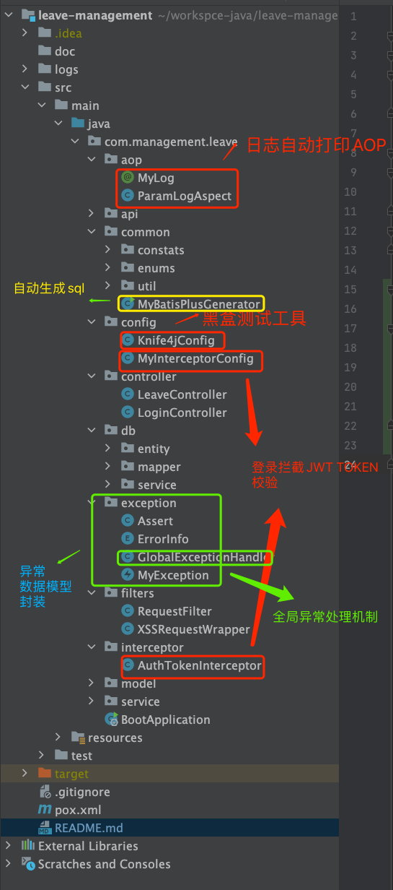

# leave management
## dependencies
- jdk1.8
- springboot2.2.7.RELEASE
- maven

## business background
this project is to build a leave management,The requirements as below: 
1、There are 3 roles in this system, employee, manager and senior manager. 
2、Employee raises the leave questions via this system
- a) If leave days < 10, manager could approve it and end the process.
- b) If the leave days >= 10, after manager approval, senior manager also be asked to approve this request.:

## Architectural Design and Framework Integration

- This project integrates Spring Boot, MySQL, MyBatis-Plus, and Redis.
- The project design includes security measures such as login authentication and anti-XSS attacks.
- The author of this project has written their own exception handling and encapsulation, as well as added a unified exception handler for fallback.
- For testing, the project uses JUnit 4 for white-box testing of core interface details and integrates Knife4j for black-box testing of overall functionality.
- The project integrates MyBatis-Plus Generator for automatic SQL generation.
- To make the code look more concise, Lombok is integrated, and a custom AOP is written for automatic log printing.

